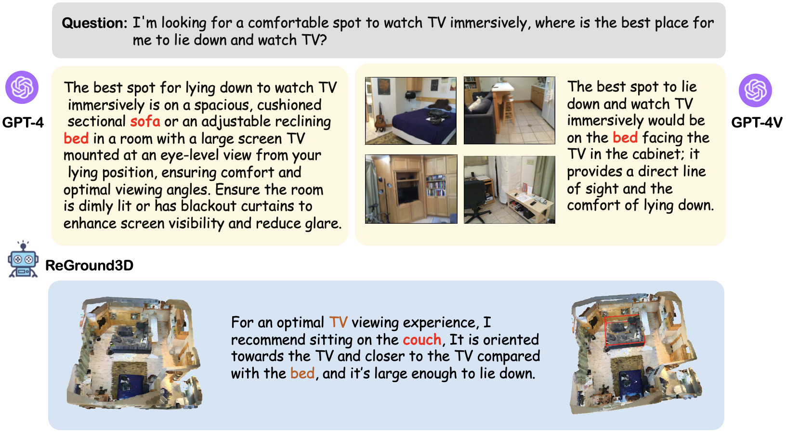
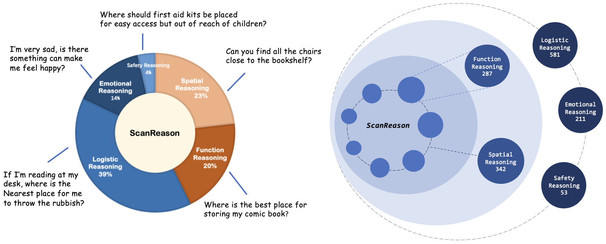
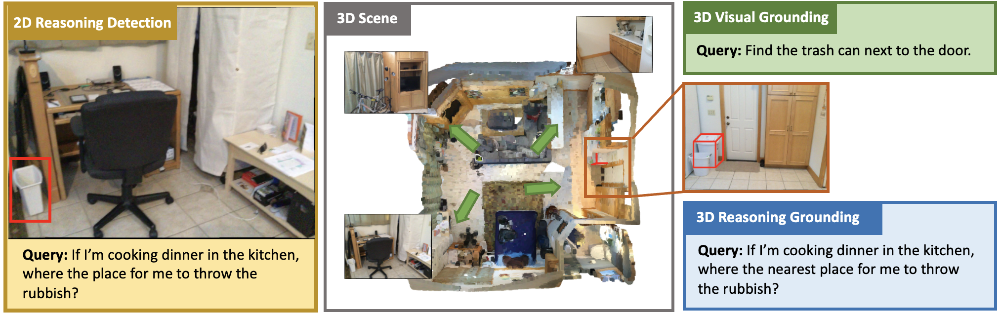
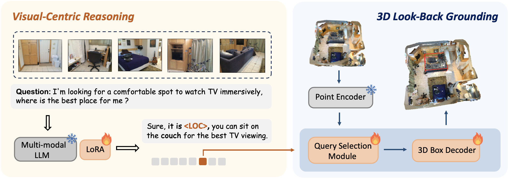

<br>
<p align="center">
<h1 align="center"><strong>Empowering 3D Visual Grounding with Reasoning Capabilities</strong></h1>
  <p align="center">
  	<strong>ECCV 2024</strong>
	<br>
    <a href='https://zcmax.github.io//' target='_blank'>Chenming Zhu</a>&emsp;
	<a href='https://tai-wang.github.io/' target='_blank'>Tai Wang</a>&emsp;
    <a href='https://zhangwenwei.cn/' target='_blank'>Wenwei Zhang</a>&emsp;
    <a href='https://chenkai.site/' target='_blank'>Kai Chen</a>&emsp;
	<a href='https://xh-liu.github.io//' target='_blank'>Xihui Liu*</a>&emsp;
    <br>
    The University of Hong Kong&emsp;Shanghai AI Laboratory
    <br>
  </p>
</p>


<div id="top" align="center">

[](https://arxiv.org/abs/2407.01525)
[](./assets/ECCV_2024_ScanReason.pdf)
[](https://zcmax.github.io/projects/ScanReason/)

</div>


## 🏠 Background
<!--  -->

<div style="text-align: center;">
    
</div>
For an embodied agent, they not only need to be able to understand the 3D
environment and complex human instructions, but also localize the target objects for
interaction and navigation. Although GPT-4 (GPT-4V) have strong text (multi-modal)
reasoning abilities, they lack the ability to directly perceive the 3D scene, understand
the 3D spatial relationships and output corresponding target object locations. In this paper, we propose a new task called 3D reasoning grounding and introduce a new benchmark **ScanReason** which provides over 10K question-answer-location pairs from five reasoning types that require the synerization of reasoning and grounding. We further design our approach, ReGround3D, composed of the visual-centric reasoning module empowered by Multi-modal Large Language Model (MLLM) and the 3D grounding module to obtain accurate object locations by looking back to the enhanced geometry and fine-grained details from the 3D scenes. A chain-of-grounding mechanism is proposed to further boost the performance with interleaved reasoning and grounding steps during inference. 

## 📦 Benchmark and Model
### Benchmark Overview
<p align="center">
  
</p>
ScanReason is the first comprehensive and hierarchical 3D reasoning grounding benchmark. We define 5 types of questions depending on which type of reasoning is required: Spatial reasoning and function reasoning require fundamental understanding of the 3D physical world, focusing on objects themselves and inter-object spatial relationships in a 3D scene respectively, and logistic reasoning, emotional reasoning, and safety reasoning are high-level reasoning skills built upon the two fundamental reasoning abilities to address user-centric real-world applications.

<p align="center">
  
</p>

### Model Overview
<p align="center">
  
</p>

## Getting Started
**1. Installation**
- We utilize at least 4 A100 GPU for training and inference.
- We test the code under the following environment:
    - CUDA 11.8
    - Python 3.9
    - PyTorch 2.1.0
- Git clone our repository and creating conda environment:
  ```bash
  git clone https://github.com/ZCMax/ReGround3D.git
  conda create -n reground3d python=3.9
  conda activate reground3d
  pip install -r requirements.txt
  ```

- Follow [EmbodiedScan Installation Doc](https://github.com/OpenRobotLab/EmbodiedScan?tab=readme-ov-file#-getting-started) to install embodiedscan series.

- Compile Pointnet2
    ```
    cd pointnet2
    python setup.py install --user
    ```

**2. Data Preparation**

1. Follow [EmbodiedScan Data Preparation Doc](https://github.com/OpenRobotLab/EmbodiedScan/blob/main/data/README.md) to download the raw scan (RGB-D) datasets and modify the `VIDEO_FOLDER` in `train_ds.sh` to the raw data path.

2. Download the text annotations from [Google Drive](https://drive.google.com/drive/folders/14SHLgKe2xKuHgpo_Cb1z_nFqXbP1jTYZ?usp=drive_link) and modify the `JSON_FOLDER` in `train_ds.sh` to the annotations path, and modify the `INFO_FILE` data path which is included in the annotations.

**3. Training ReGround3D**

We provide the slurm training script with 4 A100 GPUs:

```
./scripts/train_ds.sh
```

**4. Evaluation ReGround3D**

After training, you can run the 

```
./scripts/convert_zero_to_fp32.sh 
```

to convert the weights to `pytorch_model.bin` file, and then use

```
./scripts/merge_lora_weights.sh
```

to merge lora weight and obtain the final checkpoints under `ReGround3D-7B`.

Finally, run 

```
./scripts/eval_ds.sh
```

to obtain the grounding results.

## 📝 TODO List

- \[x\] First Release.
- \[x\] Release ReGround3D code.
- \[ \] Release ScanReason datasets and benchmark.

## 📄 License

<a rel="license" href="http://creativecommons.org/licenses/by-nc-sa/4.0/"></a>
<br />
This work is under the <a rel="license" href="http://creativecommons.org/licenses/by-nc-sa/4.0/">Creative Commons Attribution-NonCommercial-ShareAlike 4.0 International License</a>.

## 👏 Acknowledgements

This repo benefits from [LISA](https://github.com/dvlab-research/LISA), [EmbodiedScan](https://github.com/OpenRobotLab/EmbodiedScan), [3D-LLM](https://github.com/UMass-Foundation-Model/3D-LLM), [LLaVA](https://github.com/haotian-liu/LLaVA). 